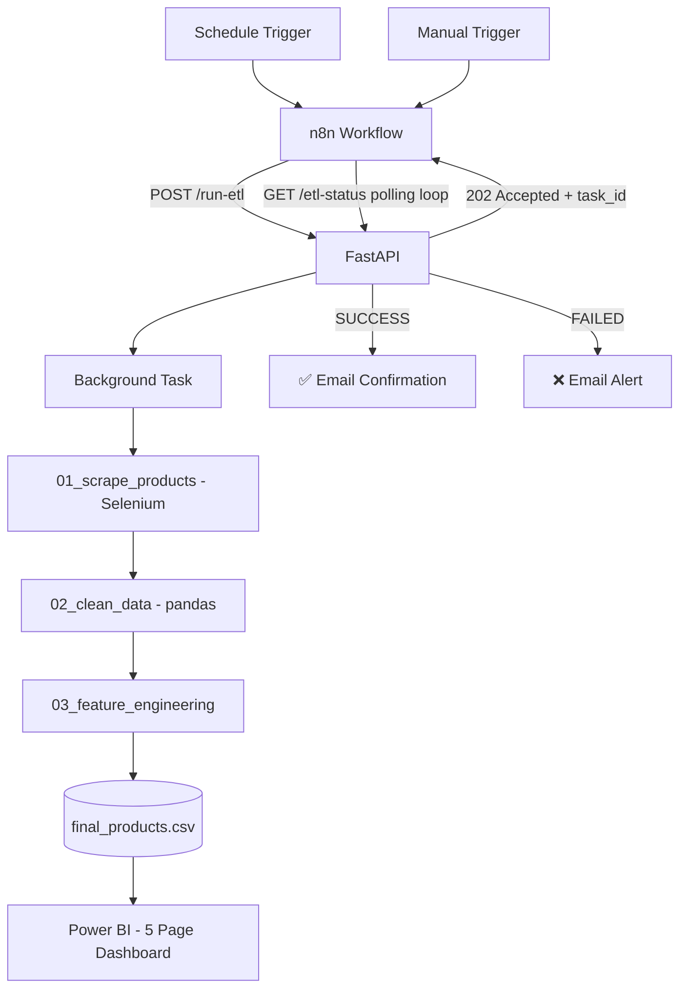

<h1 align="center">📱 Flipkart Price Intelligence — Automated ETL & BI Pipeline</h1>

  

  
  
  
  
  
  
  

---

## 🗺️ Table of Contents

<table>
  <tr>
    <td align="center">🎯 <a href="#-overview"><b>Overview</b></a></td>
    <td align="center">❓ <a href="#-business-question"><b>Business Question</b></a></td>
    <td align="center">🏗️ <a href="#-architecture"><b>Architecture</b></a></td>
  </tr>
  <tr>
    <td align="center">🧭 <a href="#-pipeline-stages"><b>Pipeline Stages</b></a></td>
    <td align="center">💡 <a href="#-key-insights"><b>Key Insights</b></a></td>
    <td align="center">⚠️ <a href="#-honest-limitations"><b>Limitations</b></a></td>
  </tr>
  <tr>
    <td align="center">🧠 <a href="#-skills-applied"><b>Skills Applied</b></a></td>
    <td align="center">🚀 <a href="#-about-me"><b>About Me</b></a></td>
    <td align="center">📫 <a href="#-lets-connect"><b>Connect</b></a></td>
  </tr>
</table>

---

## 🎯 Overview

An automated pipeline that scrapes live mobile phone listings from Flipkart, cleans and enriches them, and surfaces the result as a 5-page Power BI dashboard — no manual step required after the trigger fires.

Built as a real orchestration system, not a script: **n8n** triggers and monitors, **FastAPI** runs the work asynchronously in the background, **Selenium** handles the actual scraping, and **pandas** turns raw listings into business-ready data.

---

## ❓ Business Question

E-commerce prices shift constantly — sales, exchange offers, restocks. A shopper or analyst can't answer these from one glance at a page:

- Which listings are a *genuine* deal, not just marked down from an inflated MRP?
- Which brands over/under-price relative to their ratings?
- How does the budget-vs-flagship mix shift day to day?

**Goal:** turn scattered listings into a structured, refreshable dataset that answers this on demand.

---

## 🏗️ Architecture

n8n never scrapes — it only triggers, polls, and reports. FastAPI responds instantly and runs the real work in the background, so nothing blocks waiting on a multi-minute scrape.

---

## 🧭 Pipeline Stages

| Stage | Tool | What it does |
|---|---|---|
| 1️⃣ Orchestration | n8n | Daily + manual triggers, async polling loop, success/failure emails |
| 2️⃣ API Layer | FastAPI | Accepts trigger instantly, runs scrape in background, logs every run |
| 3️⃣ Scraping | Selenium | Renders live pages, extracts title/price/rating/specs/image |
| 4️⃣ Cleaning | pandas | Dedup, unit fixes (MB→GB), missing-value handling |
| 5️⃣ Feature Engineering | pandas | Price bands, value score, market segment, deal flags |
| 6️⃣ Reporting | Power BI | 5 pages + hover tooltip showing live product image |

---

## 💡 Key Insights

- 🐞 **Scraped data is never clean by default** — caught a real bug where MB storage was misread as GB, producing impossible values.
- 🏷️ **Discount % alone is a weak signal** — pairing it with rating and segment tells a very different story.
- ⚡ **Async design is what makes daily automation realistic** — without it, the trigger layer would freeze for minutes per run.
- 🔁 **Failure handling needs its own design** — an early version looped forever on failure since only success was checked.

---

## 🏢 What's Next

- ☁️ Move off a local laptop schedule onto a cloud VM (Azure/AWS)
- 🔗 Extend scraping to individual product pages (seller, stock, delivery)
- 📉 Build true day-over-day price-drop detection as history accumulates

---

## ⚠️ Honest Limitations

- Local scheduling needs the host machine powered on — no catch-up on missed runs
- Flipkart's CSS classes aren't guaranteed stable across redeploys
- Deeper product-page fields are out of scope for now (time/risk tradeoff)
- Listing volume reflects search ranking, not true market share

---

## 🧠 Skills Applied

- **Async System Design** — trigger → background task → polling, production-style
- **Resilient Web Scraping** — handled anti-bot blocks and shifting DOM structure
- **Data Quality Auditing** — caught a real unit-conversion bug via range validation
- **Business Feature Engineering** — value scores and segments tied to real decisions

---

## 🚀 About Me

I'm **Bernad Meckenzi** — moving from medical billing into data analytics/BI, one built-and-broken project at a time.

| 🔧 Area | 🌟 Tools |
|---|---|
| ⚙️ Automation | n8n, FastAPI, Python |
| 🕸️ Data Collection | Selenium, BeautifulSoup |
| 🐍 Data Wrangling | Pandas, NumPy |
| 📈 BI | Power BI, DAX, Power Query |
| 🗄️ Querying | SQL |

---

## 📫 Let's Connect

⭐ **If this showed you a real async ETL + BI pipeline end to end, a star would help.**

