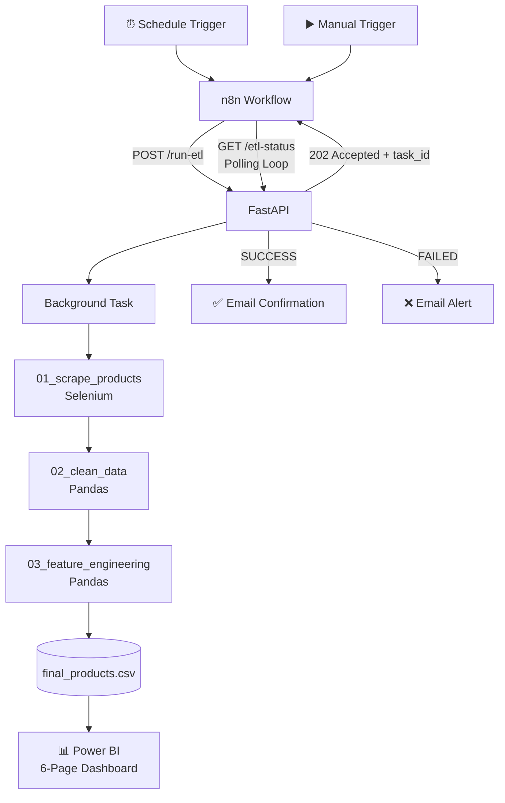

<h1 align="center">📱 Flipkart Price Intelligence — Automated ETL & BI Pipeline</h1>

<p align="center">
  
</p>

<p align="center">
  
  
  
  
  
  
  
</p>

<p align="center">
  <b>📊 An end-to-end automated pipeline for collecting, transforming, analyzing, and visualizing Flipkart mobile phone pricing data.</b>
</p>

---

<div align="center">

## 🗺️ Table of Contents

<table>
  <tr>
    <td align="center">🎯<br><a href="#-overview"><b>Overview</b></a></td>
    <td align="center">❓<br><a href="#-business-question"><b>Business Question</b></a></td>
    <td align="center">🏗️<br><a href="#️-architecture"><b>Architecture</b></a></td>
  </tr>
  <tr>
    <td align="center">🧭<br><a href="#-pipeline-stages"><b>Pipeline</b></a></td>
    <td align="center">📊<br><a href="#-dashboard-preview"><b>Dashboard</b></a></td>
    <td align="center">💡<br><a href="#-key-insights"><b>Insights</b></a></td>
  </tr>
  <tr>
    <td align="center">⚠️<br><a href="#-honest-limitations"><b>Limitations</b></a></td>
    <td align="center">🧠<br><a href="#-skills-applied"><b>Skills</b></a></td>
    <td align="center">📫<br><a href="#-lets-connect"><b>Connect</b></a></td>
  </tr>
</table>

</div>

---

## 🎯 Overview

**Flipkart Price Intelligence** is an automated ETL and Business Intelligence project that collects mobile phone listings, cleans and enriches the data, and transforms it into an interactive **6-page Power BI dashboard**.

The project is designed as an **orchestrated data pipeline rather than a standalone scraping script**.

The workflow combines:

* ⚙️ **n8n** for orchestration and automation
* 🚀 **FastAPI** for asynchronous task execution
* 🕸️ **Selenium** for dynamic web scraping
* 🐍 **Pandas** for data cleaning and transformation
* 📊 **Power BI** for business intelligence and visualization

### 🔄 End-to-End Flow

<p align="center">

<b>🕸️ Scrape</b>
  →   <b>🧹 Clean</b>
  →   <b>⚙️ Engineer</b>
  →   <b>💾 Store</b>
  →   <b>📊 Analyze</b>

</p>

The final output is a business-facing dashboard designed to explore **pricing, discounts, product value, brands, segments, and price trends over time**.

---

## ❓ Business Question

E-commerce prices change constantly because of discounts, promotions, product positioning, and market conditions.

A simple product listing does not provide enough context to answer questions such as:

* 💰 Which products offer strong value for their price?
* 🏷️ Which products have significant discounts?
* ⭐ How do price, rating, and value relate to each other?
* 📱 How are products distributed across different market segments?
* 🏢 Which brands dominate different price segments?
* 📉 How do prices change as historical snapshots accumulate?
* 🔎 Which products deserve closer investigation?

### 🎯 Project Goal

Build a **refreshable data pipeline** that converts raw e-commerce listings into structured, business-ready data that can be analyzed through Power BI.

---

## 🏗️ Architecture



### ⚡ Why the Architecture Matters

n8n does **not** perform the scraping itself.

Instead:

1. n8n triggers the ETL process.
2. FastAPI immediately returns a task ID.
3. FastAPI runs the ETL process as a background task.
4. n8n periodically checks the task status.
5. The pipeline reports either success or failure.
6. The transformed dataset feeds Power BI.

This prevents the orchestration layer from being blocked by a multi-minute scraping process.

---

## 🧭 Pipeline Stages

| Stage                   | Technology   | Responsibility                                         |
| ----------------------- | ------------ | ------------------------------------------------------ |
| 1️⃣ Orchestration       | **n8n**      | Daily/manual triggers, polling, notifications          |
| 2️⃣ API Layer           | **FastAPI**  | Receives requests and manages background execution     |
| 3️⃣ Data Collection     | **Selenium** | Renders pages and extracts product information         |
| 4️⃣ Data Cleaning       | **Pandas**   | Deduplication, missing values, unit corrections        |
| 5️⃣ Feature Engineering | **Pandas**   | Price bands, value scores, market segments, deal flags |
| 6️⃣ Data Output         | **CSV**      | Stores transformed business-ready data                 |
| 7️⃣ BI Layer            | **Power BI** | Interactive dashboards and business analysis           |

---

# 📊 Dashboard Preview

The final Power BI solution contains **6 analytical pages**, moving from a high-level overview into pricing, products, deals, trends, and brand/segment analysis.

---

## 🏠 01 — Home

<p align="center">
  
</p>

**Purpose:** High-level snapshot of the mobile phone marketplace.

Provides a starting point for exploring the overall dataset and navigating into deeper analysis.

---

## 💰 02 — Price Overview

<p align="center">
  
</p>

**Purpose:** Understand the distribution and behavior of product prices.

Focus areas include:

* Price distribution
* Average pricing
* Discount patterns
* Product positioning
* Price ranges

---

## 📱 03 — Product Overview

<p align="center">
  
</p>

**Purpose:** Explore individual products and their characteristics.

The page helps analyze product-level information such as:

* Product price
* Rating
* Specifications
* Product positioning
* Value-related metrics

---

## 🏷️ 04 — Deal & Value Analysis

<p align="center">
  
</p>

**Purpose:** Identify products that appear attractive based on pricing, discount, rating, and engineered value metrics.

This moves beyond simply asking:

> "Which product has the biggest discount?"

and instead considers multiple product attributes together.

---

## 📈 05 — Trend Over Time

<p align="center">
  
</p>

**Purpose:** Monitor price behavior across historical scraping snapshots.

As additional daily snapshots accumulate, this page can support:

* Price movement analysis
* Product price tracking
* Brand-level trends
* Segment-level trends
* Historical comparison

---

## 🏢 06 — Brand & Segment Deep-Dive

<p align="center">
  
</p>

**Purpose:** Analyze how brands are positioned across different market segments.

This enables comparisons across:

* Brands
* Price bands
* Market segments
* Ratings
* Product counts
* Value metrics

---

## 🔍 Interactive Product Detail

The dashboard also uses product-level interactions and hover information to provide additional context without overcrowding the main visuals.

Where configured, product images can be displayed through Power BI tooltip interactions.

---

# 💡 Key Insights

### 🐞 Data Quality Can Create Business Problems

During development, a real data-quality issue was identified where **MB storage values were incorrectly interpreted as GB**, creating unrealistic values.

Range validation helped identify the issue before the data reached the final analytical layer.

---

### 🏷️ Discount % Alone Is Not Enough

A high discount percentage does not automatically mean a product represents strong value.

A more useful analysis combines:

**Price + Discount + Rating + Product Segment + Value Metrics**

This provides more context for evaluating product positioning.

---

### ⚡ Async Architecture Makes Automation Practical

A scraping process can take several minutes.

Running that process directly inside the orchestration layer could block the workflow.

Using:

**n8n → FastAPI → Background Task → Polling**

allows the orchestration layer to remain responsive while the ETL process runs independently.

---

### 🔁 Failure Handling Needs Its Own Design

An early workflow version could continue polling indefinitely when the ETL process failed because it only checked for successful completion.

The workflow was subsequently designed to handle both:

```text
SUCCESS → Confirmation Email
FAILED  → Failure Alert
```

---

# 🧠 Data & Feature Engineering

The raw scraped data is transformed into business-oriented analytical features.

### Examples

| Feature           | Purpose                                    |
| ----------------- | ------------------------------------------ |
| 💰 Price Band     | Groups products into pricing ranges        |
| ⭐ Rating          | Measures customer rating                   |
| 🏷️ Discount      | Measures markdown from listed MRP          |
| 💎 Value Score    | Combines relevant product attributes       |
| 📱 Market Segment | Categorizes products by positioning        |
| 🚨 Deal Flag      | Identifies potentially attractive listings |

The objective is not simply to collect data, but to transform it into **decision-support information**.

---

# ⚠️ Honest Limitations

This project intentionally has several limitations.

* 💻 Local scheduling requires the host machine to remain powered on.
* 🔄 Missed local runs do not automatically catch up.
* 🕸️ Flipkart CSS selectors and DOM structures can change.
* 🛡️ Anti-bot mechanisms can affect scraping reliability.
* 🔎 Individual product-page fields such as seller, stock, and delivery details are currently outside the pipeline scope.
* 📊 Listing volume reflects the products surfaced by the search/listing pages and should not be interpreted as total market share.
* 📅 Meaningful price-trend analysis requires multiple historical snapshots.

---

# 🚀 What's Next

### ☁️ Cloud Deployment

Move the locally hosted automation onto a cloud environment such as:

**Azure / AWS VM**

This would allow scheduled execution without depending on a personal computer.

### 🔗 Product-Level Scraping

Extend the pipeline to individual product pages to capture:

* Seller
* Stock availability
* Delivery information
* Additional specifications

### 📉 Historical Price Intelligence

Accumulate daily snapshots to enable:

* Day-over-day price changes
* Product price-drop alerts
* Historical minimum/maximum prices
* Brand-level price movement
* Segment-level trend analysis

---

# 🛠️ Tech Stack

<p align="center">


</p>

---

# 🧠 Skills Applied

### ⚙️ Automation & System Design

* Async ETL orchestration
* API-based workflow triggering
* Background task execution
* Workflow polling
* Success/failure handling
* Automated notifications

### 🕸️ Data Collection

* Selenium web scraping
* Dynamic webpage handling
* DOM-based extraction
* Scraping reliability considerations

### 🧹 Data Engineering

* Data cleaning
* Deduplication
* Missing-value handling
* Unit normalization
* Data validation
* Feature engineering

### 📊 Business Intelligence

* Power BI dashboard development
* DAX measures
* Interactive filtering
* Tooltip design
* Trend analysis
* Segmentation
* KPI analysis

### 💼 Business Analytics

* Business-question framing
* Product comparison
* Pricing analysis
* Deal/value analysis
* Brand analysis
* Market segmentation

---

# 📁 Project Structure

```text
flipkart-price-intelligence-etl/
│
├── dashboard/
│   └── screenshots/
│       ├── Home.png
│       ├── Price Overview.png
│       ├── Product Overview.png
│       ├── Deal & Value Analysis.png
│       ├── Trend Over Time.png
│       └── Brand & Segment Deep-Dive.png
│
├── src/
│   ├── 01_scrape_products
│   ├── 02_clean_data
│   └── 03_feature_engineering
│
├── data/
│   └── final_products.csv
│
├── workflows/
│   └── n8n workflow
│
├── api/
│   └── FastAPI application
│
└── README.md
```

---

# 🚀 About Me

I'm **Bernad Meckenzi** — transitioning into **Data Analytics / Business Intelligence**, with a focus on building practical projects that combine technical data skills with business thinking.

I enjoy building projects where the goal is not just:

> **"Can I write the code?"**

but also:

> **"Can this data help answer a real business question?"**

### Current Focus

| Area                     | Tools                                           |
| ------------------------ | ----------------------------------------------- |
| ⚙️ Automation            | n8n, FastAPI, Python                            |
| 🕸️ Data Collection      | Selenium, BeautifulSoup                         |
| 🐍 Data Wrangling        | Pandas, NumPy                                   |
| 📈 Business Intelligence | Power BI, DAX, Power Query                      |
| 🗄️ Querying             | SQL                                             |
| 📊 Analytics             | EDA, KPI Analysis, Segmentation, Trend Analysis |

---

# 📫 Let's Connect

<div align="center">

<a href="https://github.com/Bernad2304">
  
</a>

<a href="https://www.linkedin.com/in/bernad-meckenzi-s">
  
</a>

<br><br>

⭐ **If you found this project useful or interesting, consider giving the repository a star.**

</div>

---

<p align="center">
  <i>Scrape → Clean → Engineer → Analyze → Visualize → Automate</i>
</p>
